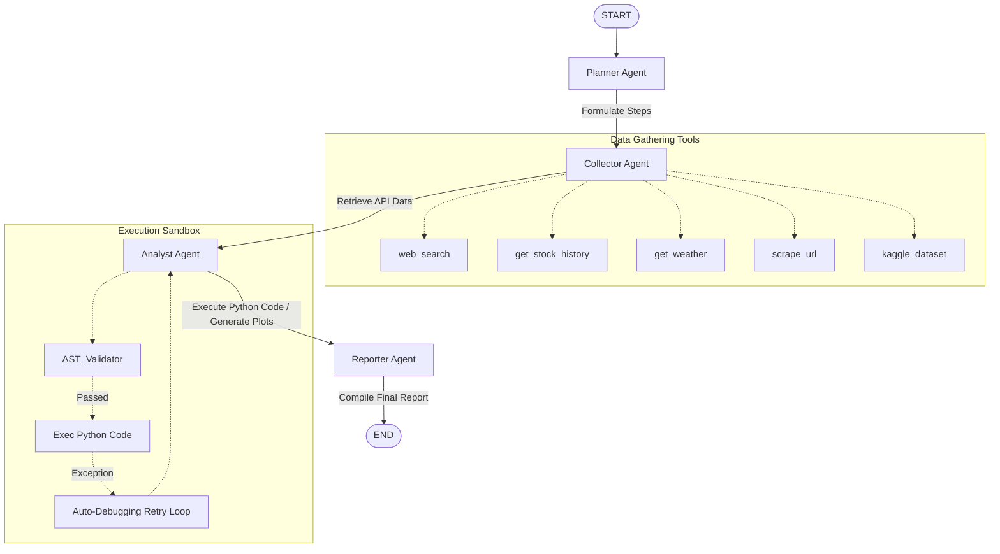

# 📊 Autonomous Data Analyst Agent

An autonomous, multi-agent data analytics and insights system built with Python, **LangGraph**, and **LangChain**. The system takes complex, unstructured user requests, plans the research strategy, gathers real-time data through external APIs, processes calculations in a secured execution sandbox, plots visualizations, and compiles a comprehensive analysis report.

A glassmorphic **Streamlit Web Dashboard** is provided to run queries, visualize interactive graph executions, preview output datasets, and inspect the state machine details step-by-step.

---

## 🚀 Key Features

*   **Autonomous State Machine**: Built on **LangGraph** using a robust state manager that maintains logs, collected data, execution history, charts, and error reports across nodes.
*   **Robust Multi-Agent Collaboration**:
    *   **Planner Node**: Formulates a detailed data collection and analysis roadmap.
    *   **Collector Node**: Queries APIs and automatically resolves missing parameters (e.g., auto-extracting location names or ticker symbols from queries using the LLM).
    *   **Analyst Node**: Writes and runs Pandas/Matplotlib/Seaborn scripts inside a secured sandbox with auto-debugging retry logic.
    *   **Reporter Node**: Aggregates insights, metrics, and chart files into a polished markdown report.
*   **Comprehensive Tool Suite**: Ready-to-use integrations for financial data (`yfinance`), weather (`OpenWeatherMap`/`wttr.in`), web searches (`Tavily`/`DuckDuckGo`), web scraping (`Jina Reader`/`BeautifulSoup`), and Kaggle datasets.
*   **AST-Protected Sandbox**: Safeguards the local environment from arbitrary code execution via AST parsing verification.
*   **Evals & Verification Suite**: Complete benchmark scoring system to track execution quality, chart creations, and report completeness.

---

## 🛠️ Project Architecture

```
Autonomous-Data-Analyst-Agent/
├── .env.template               # Environment variables template
├── requirements.txt            # Python dependencies
├── pyproject.toml              # Project metadata & dependency specifications
├── Dockerfile                  # Containerization instructions
├── main.py                     # CLI Entry point
├── app.py                      # Streamlit Web Dashboard
│
├── src/
│   ├── config.py               # API keys and LLM configuration
│   ├── state.py                # TypedDict representing graph state
│   ├── graph.py                # StateGraph initialization and edges
│   │
│   ├── agents/                 # Multi-Agent Nodes
│   │   ├── planner.py          # Roadmap formulator
│   │   ├── collector.py        # Intelligent parameter-resolving data harvester
│   │   ├── analyst.py          # Code writer & auto-debugging sandbox execution loop
│   │   └── reporter.py         # Final report formatter & publisher
│   │
│   └── tools/                  # Integration Tools
│       ├── search.py           # Web search (Tavily/DuckDuckGo)
│       ├── finance.py          # Stock financials and history (yfinance)
│       ├── weather.py          # Current & forecast weather (OpenWeather/wttr)
│       ├── scraper.py          # Web content extraction (Jina/BeautifulSoup)
│       ├── kaggle_tool.py      # Kaggle dataset searches and downloads
│       └── sandbox.py          # AST-validated Python code executor
│
├── output/                     # Saved charts, datasets, and markdown reports
├── verify_sandbox.py           # Verification script for sandbox and guardrails
└── run_evals.py                # Benchmarking and evaluations
```



---

## 🛡️ Sandbox Security Model

To prevent dangerous filesystem operations or network access from LLM-generated code, the execution sandbox ([src/tools/sandbox.py](src/tools/sandbox.py)) passes scripts through an **Abstract Syntax Tree (AST)** validator prior to execution:

*   **Blocked Modules**: Direct imports or module references to `os`, `sys`, `subprocess`, `shutil`, `socket`, `urllib`, `requests`, `builtins`, `ctypes`, `threading`, `multiprocessing`, `importlib`.
*   **Blocked Built-in Calls**: Functions like `eval()`, `exec()`, `open()`, `compile()`, `getattr()`, `setattr()`, `delattr()`, `globals()`, `locals()`.
*   **Safe Execution Environment**: Execution is supplied with a controlled namespace preloaded with `pandas`, `numpy`, `matplotlib`, `seaborn`, `OUTPUT_DIR` path, and a safe path-joining utility `path_join` (aliasing `os.path.join`). 

---

## 🧠 Robust Parameter Resolution

The collector node ([src/agents/collector.py](src/agents/collector.py)) incorporates auto-resolution heuristics to handle missing or generic argument values generated during LLM mapping:
1.  **Fault-Tolerant Signatures**: Tools are built with `**kwargs` so that unexpected parameter variations do not raise Python `TypeError` and crash the Graph.
2.  **Location & Ticker Extraction**: If the planner generates a generic step (e.g. *"Check weather for the location"*), the collector node calls the LLM to dynamically extract the specific target city or stock ticker from the original user query, falling back to safe defaults (e.g., `"New York"` or `"SPY"`) to preserve pipeline execution.
3.  **JSON Fallback Recovery**: If structured output fails, conversational JSON representations are securely extracted and parsed from code blocks or curly braces, avoiding unexpected collection loop terminates.

---

## 🚀 Setup & Installation

### 1. Configure Environment Variables
Copy `.env.template` to `.env`:
```bash
cp .env.template .env
```
Open `.env` and fill in your keys (e.g., `GROQ_API_KEY`, `TAVILY_API_KEY`, `OPENWEATHER_API_KEY`, `KAGGLE_USERNAME`, `KAGGLE_KEY`). Llama-3.3-70b via Groq is configured as the default model.

### 2. Local Installation
Verify you are running Python 3.10+, then install dependencies:
```bash
pip install -r requirements.txt
```

*   **Launch Streamlit Web UI**:
    ```bash
    streamlit run app.py
    ```
    Access the UI dashboard at `http://localhost:8501`.
*   **Run CLI Interface**:
    ```bash
    python main.py --query "What is the weather trend in Tokyo today? Query the current details, mock a retail dataset, and plot the correlations."
    ```

### 3. Docker Isolation (Recommended for Production)
Execute the agent inside an isolated container to ensure security:
*   **Build the Container Image**:
    ```bash
    docker build -t data-analyst-agent .
    ```
*   **Run the Container**:
    ```bash
    docker run -d -p 8501:8501 --env-file .env data-analyst-agent
    ```
    Access the dashboard at `http://localhost:8501`.

---

## 🧪 Testing & Benchmark Evals

### Sandbox & Security Verification
To test sandbox execution, plotting interception, and verification of security blocks:
```bash
python verify_sandbox.py
```
This prints reports and checks that both matplotlib output capture and malicious command blocks are performing correctly.

### Benchmark Evaluation Suite
Evaluate the agent's capabilities using the built-in benchmark runner:
```bash
python run_evals.py
```
This executes standard benchmark scenarios, evaluates planning quality, data collection, sandbox script execution, visualization creation, and report structure, saving results to `output/eval_benchmark_results.csv`.

