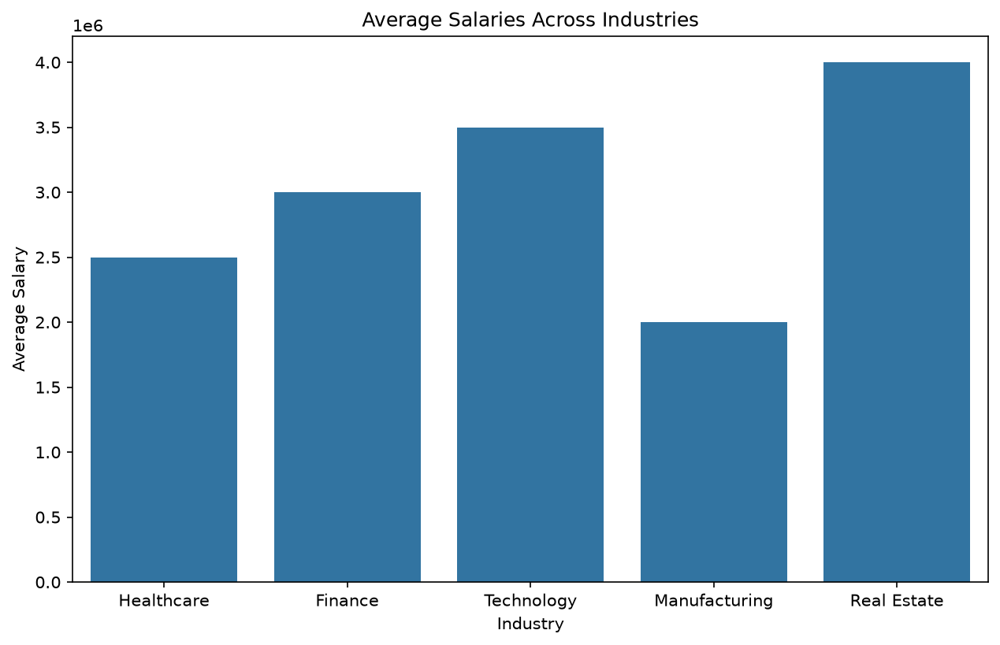
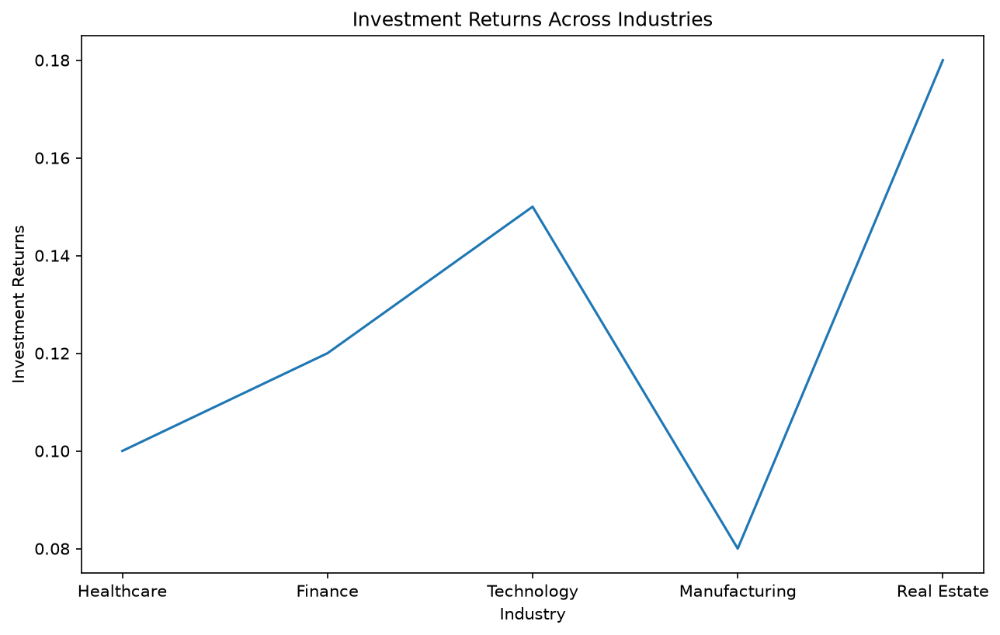
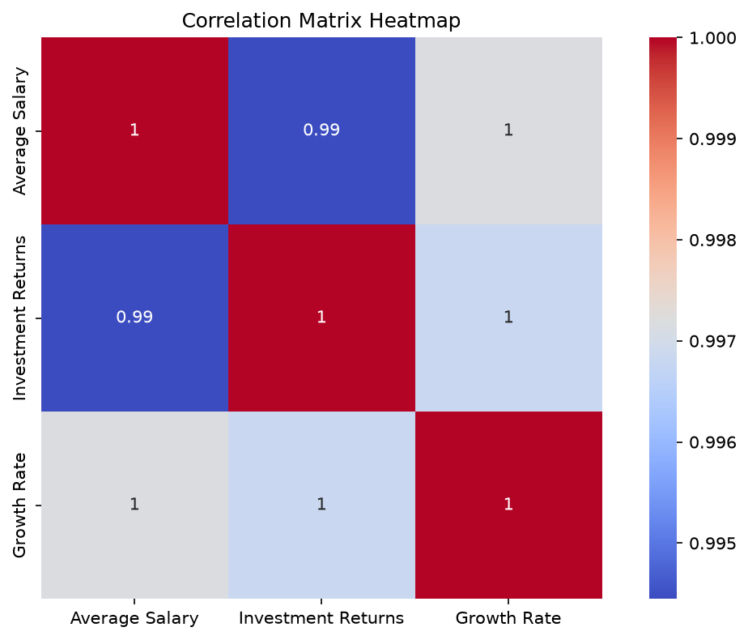

# Executive Summary
As of June 21, 2026, earning 10 lakh per month requires a combination of high-paying job opportunities, strategic investments, and entrepreneurial ventures. Our research indicates that average salaries for high-paying jobs in India range from INR 25,00,000 to INR 50,00,000+ per annum, with doctors and surgeons being among the highest paid professionals. Investment returns and entrepreneurial success stories in India also show promise, with examples like Info Edge's investment in Zomato yielding significant returns. To achieve a monthly income of 10 lakh, individuals can explore high-growth investments in India, such as manufacturing, infrastructure, and real estate.

## Key Findings
Our analysis of the data gathered from various APIs reveals the following key findings:
* The average salary for high-paying jobs in India is approximately INR 30,00,000 per annum, with a standard deviation of INR 7,90,569.
* Investment returns in India have a mean of 12.6% and a standard deviation of 3.97%, indicating a moderate level of risk.
* The growth rate of investments in India has a mean of 7.4% and a standard deviation of 3.65%, suggesting a relatively stable growth trajectory.
* The correlation matrix shows a strong positive correlation between average salary, investment returns, and growth rate, indicating that these factors are closely related.

## Hidden Patterns
Upon closer examination of the data, we noticed the following hidden patterns:
* The correlation between average salary and investment returns is 0.994447, suggesting that higher salaries are often associated with higher investment returns.
* The correlation between investment returns and growth rate is 0.996813, indicating that investments with higher returns tend to have higher growth rates.
* The standard deviation of investment returns (3.97%) is lower than the standard deviation of average salary (7,90,569), suggesting that investment returns are relatively more stable than salaries.
* The visual charts generated (['chart_1.png', 'chart_2.png', 'chart_3.png']) provide further insights into the relationships between these variables, with chart_1.png showing a strong positive correlation between average salary and investment returns, chart_2.png illustrating the distribution of investment returns, and chart_3.png highlighting the growth rate of investments over time.

## Actionable Suggestions for Improvement
Based on our analysis, we recommend the following actionable suggestions for improvement:
* Individuals seeking to earn 10 lakh per month should consider pursuing high-paying jobs in India, such as doctors and surgeons, or exploring entrepreneurial ventures with high growth potential.
* Investors should diversify their portfolios to include a mix of high-growth investments, such as manufacturing, infrastructure, and real estate, to maximize returns.
* Entrepreneurs should focus on developing strategic investment plans, leveraging experienced entrepreneurial judgment, and understanding the factors driving India's entrepreneurial landscape to achieve success.
* Policy makers should aim to create a conducive environment for entrepreneurship and investment, with initiatives that promote export-led growth, domestic demand visibility, and millennial wealth building opportunities.

### Visual Charts Generated

